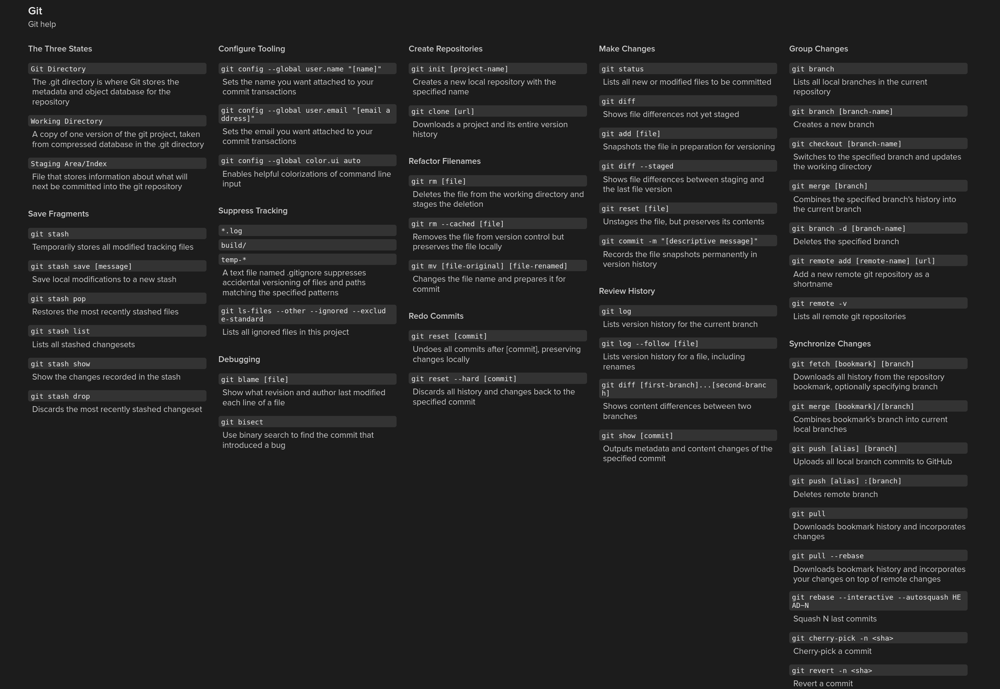
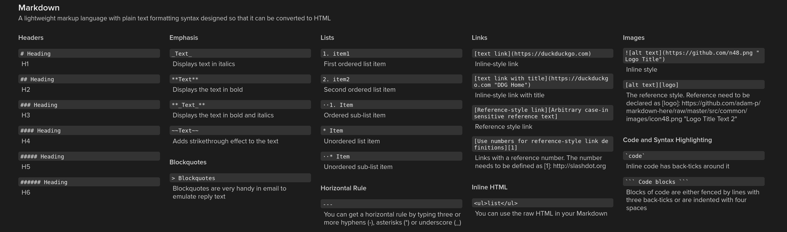

# Project Name

## Milestones

### Milestone 1

The Goal is to display and visualize data received/measured from a Raspberry Pi on a webinterface.

### Milestone 2

The Raspberry Pi should be integratable to a Home Assistant Server and be used as as sensor input and opitionally logic level output.

### Milestone 3

Data should be sent and received via MQTT to an ESP32. The Pi acts as a sensor gateway.

## Tech Stack

- **Raspberry Pi model**:
- **Programming languages**: Python
- **Frameworks/tools/Libraries**: (e.g., Flask, GPIO Zero)

## Hardware Requirements

- Raspberry Pi with [model/specs]
- **Sensors**:
  - LER (Lichtsensor)
  - Temperatur und Luftfeuchtigkeit
  - ...

## Docs

- `requirements.txt`
  This file holds the requirements for pip
- `shell.nix`
  This file is only used on nixos and for the nix packagemananger
- `main.py`
  The main file for the project

### Git Help

### MarkDown Help

## Arbeitsaufträge / Aufgabeneinteilung

### Zu Vergeben

- Präsentation
- Programme:
  - Daten von RPI erfassen und sauber abspeichern
  - Daten an einem Webserver anzeigen

| Kieler | Chiara |
| ------ | ------ |
| Git    |        |
| Readme |        |
|        |        |

### Acknowledgments

[Chiara](https://git.miaig.dev/chiara)
[Kieler](https://git.miaig.dev/mia)

### License

MIT
