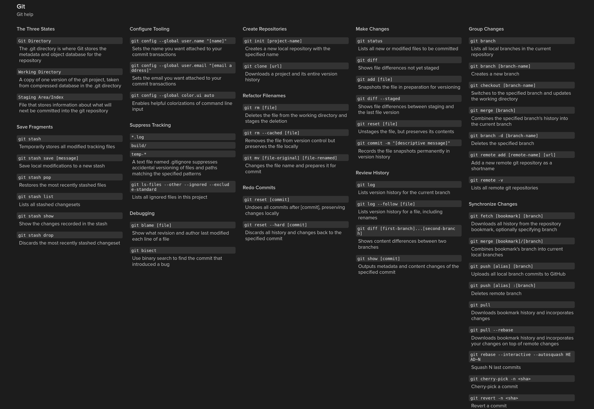
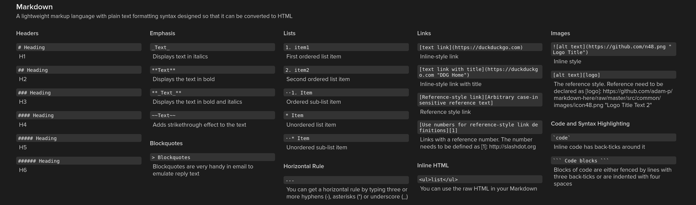
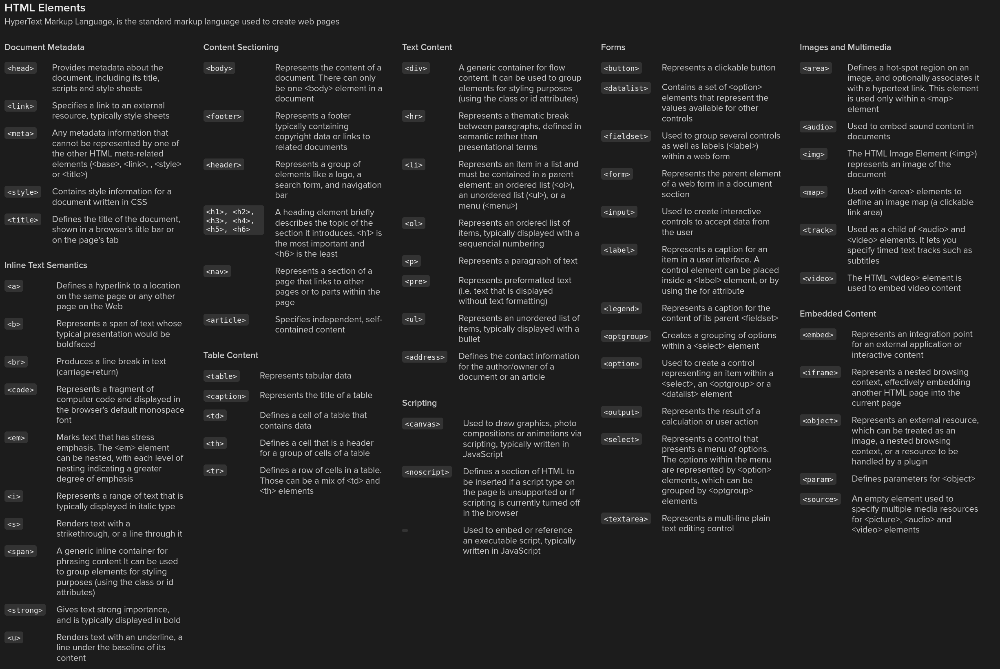
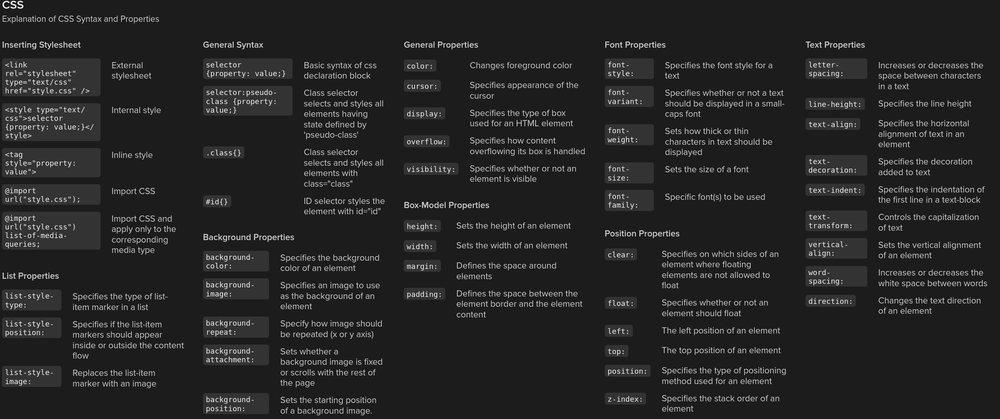
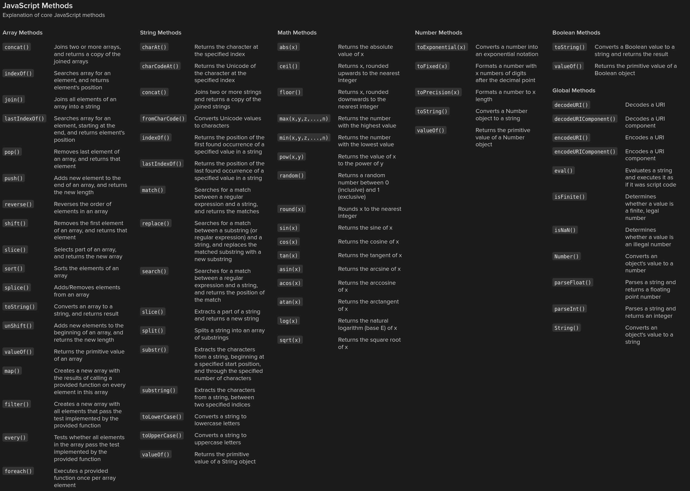
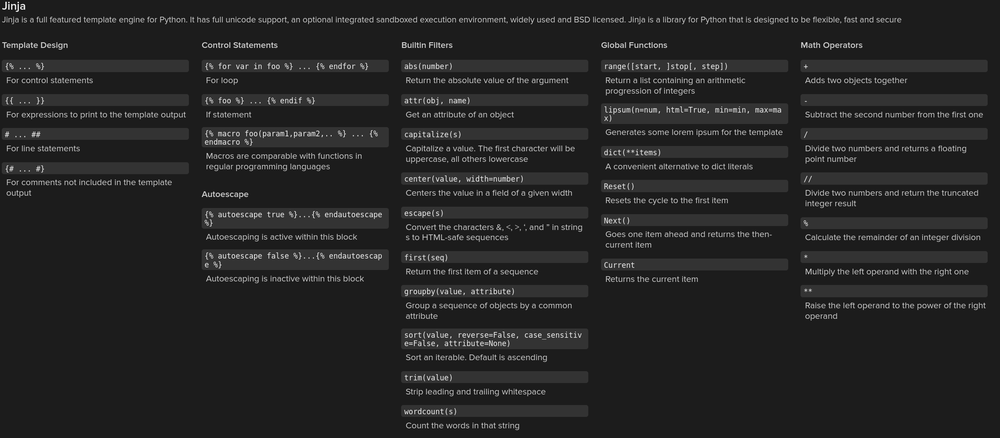

# PiWebSense

## Milestones

### Milestone 1

The Goal is to display and visualize data received/measured from a Raspberry Pi on a webinterface.

### Milestone 2

The Raspberry Pi should be integratable to a Home Assistant Server and be used as as sensor input and opitionally logic level output.

### Milestone 3

Data should be sent and received via MQTT to an ESP32. The Pi acts as a sensor gateway.

## Tech Stack / Hardware Requirements

- **Raspberry Pi**: Model 4
- **Programming languages**: Python, jinja, HTML, CSS, JavaScript
- **Frameworks/tools/Libraries**:
  - Webserver:
    - flask
    - json
    - matplotlib
    - hashlib
    - socket
    - threading
    - os
    - datetime
  - Sensors:
    - datetime
    - time
    - json
    - os
    - board
    - adafruit_dht
    - digitalio
    - RPI.GPIO
    
- **Sensors**:
  - LDR (Lightsensor)
  - Sound Detector
  - Temperature and humidity

## Docs

- The data needs to be providet in the following format:

  ```Json
      {
      "location": "Building A - Lab 3",
      "sensors": [
        {
          "id": "sensor_001",
          "type": "temperature",
          "unit": "°C",
          "readings": [
            { "ts": 1747814400, "value": 22.5 },
            { "ts": 1747818000, "value": 23.0 },
            { "ts": 1747821600, "value": 23.7 }
          ]
        },
        {
          "id": "sensor_002",
          "type": "humidity",
          "unit": "%",
          "readings": [
            { "ts": 1747814400, "value": 45.2 },
            { "ts": 1747818000, "value": 47.1 },
            { "ts": 1747821600, "value": 46.8 }
          ]
        },
        {
          "id": "sensor_003",
          "type": "pressure",
          "unit": "hPa",
          "readings": [
            { "ts": 1747814400, "value": 1012.4 },
            { "ts": 1747818000, "value": 1012.8 },
            { "ts": 1747821600, "value": 1013.0 }
          ]
        }
      ]
    }
  ```

- `shell.nix`
  This file is only used for the nix packagemananger to set up a development environment for the Webserver only
- `.envrc`
  This is also a bit of linux nixos magic to automatically set up the development environment using direnv
- `main.py`
  The main file for the project

### Git Help



### MarkDown Help



### Html Help



### Css Help



### JavaScript Help



### Jinja Help




## Arbeitsaufträge / Aufgabeneinteilung


| Mia                               | Chiara                                        |
| --------------------------------- | --------------------------------------------- |
| Git                               | Daten von RPI erfassen und sauber abspeichern |
| Readme                            | Präsentation                                  |
| Daten an einem Webserver anzeigen |                                               |

### Acknowledgments

[Chiara](https://git.miaig.dev/chiara)
[Mia](https://git.miaig.dev/mia)

### License

PiWebSense
Copyright (C) 2025 Mia, Chiara

This program is free software: you can redistribute it and/or modify
it under the terms of the GNU Affero General Public License Version 3.0 as published by
the Free Software Foundation.

This program is distributed in the hope that it will be useful,
but WITHOUT ANY WARRANTY; without even the implied warranty of
MERCHANTABILITY or FITNESS FOR A PARTICULAR PURPOSE. See the
GNU Affero General Public License for more details.

You should have received a copy of the GNU Affero General Public License
along with this program. If not, see <https://www.gnu.org/licenses/>.
