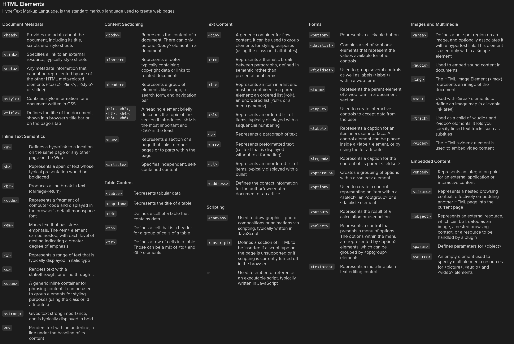

# Project Name

## Milestones

### Milestone 1

The Goal is to display and visualize data received/measured from a Raspberry Pi on a webinterface.

### Milestone 2

The Raspberry Pi should be integratable to a Home Assistant Server and be used as as sensor input and opitionally logic level output.

### Milestone 3

Data should be sent and received via MQTT to an ESP32. The Pi acts as a sensor gateway.

## Tech Stack

- **Raspberry Pi model**:
- **Programming languages**: Python
- **Frameworks/tools/Libraries**: (e.g., Flask, GPIO Zero)
  - Webserver:
    - Python Http Server
    - Json
  - Sensors:

## Hardware Requirements

- Raspberry Pi with [model/specs]
- **Sensors**:
  - LER (Lichtsensor)
  - Temperatur und Luftfeuchtigkeit
  - ...

## Docs

- Json format:

  ```Json
      {
      "location": "Building A - Lab 3",
      "sensors": [
        {
          "id": "sensor_001",
          "type": "temperature",
          "unit": "°C",
          "readings": [
            { "ts": 1747814400, "value": 22.5 },
            { "ts": 1747818000, "value": 23.0 },
            { "ts": 1747821600, "value": 23.7 }
          ]
        },
        {
          "id": "sensor_002",
          "type": "humidity",
          "unit": "%",
          "readings": [
            { "ts": 1747814400, "value": 45.2 },
            { "ts": 1747818000, "value": 47.1 },
            { "ts": 1747821600, "value": 46.8 }
          ]
        },
        {
          "id": "sensor_003",
          "type": "pressure",
          "unit": "hPa",
          "readings": [
            { "ts": 1747814400, "value": 1012.4 },
            { "ts": 1747818000, "value": 1012.8 },
            { "ts": 1747821600, "value": 1013.0 }
          ]
        }
      ]
    }
  ```

- `requirements.txt`
  This file holds the requirements for pip
- `shell.nix`
  This file is only used on nixos and for the nix packagemananger
- `main.py`
  The main file for the project

### Git Help


### MarkDown Help


### Html Help



## Arbeitsaufträge / Aufgabeneinteilung

### Zu Vergeben

- Präsentation

| Kieler                            | Chiara                                        |
| --------------------------------- | --------------------------------------------- |
| Git                               | Daten von RPI erfassen und sauber abspeichern |
| Readme                            |                                               |
| Daten an einem Webserver anzeigen |                                               |

### Acknowledgments

[Chiara](https://git.miaig.dev/chiara)
[Kieler](https://git.miaig.dev/mia)

### License

MIT
